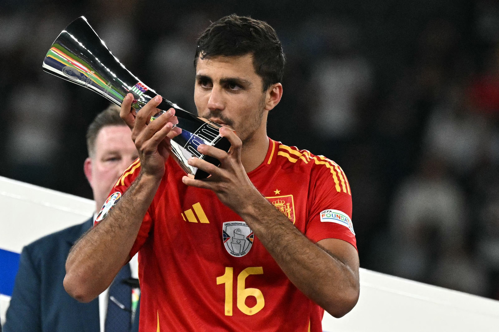
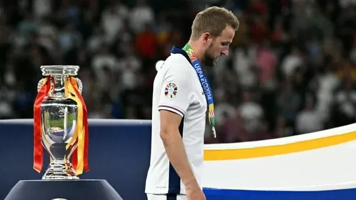
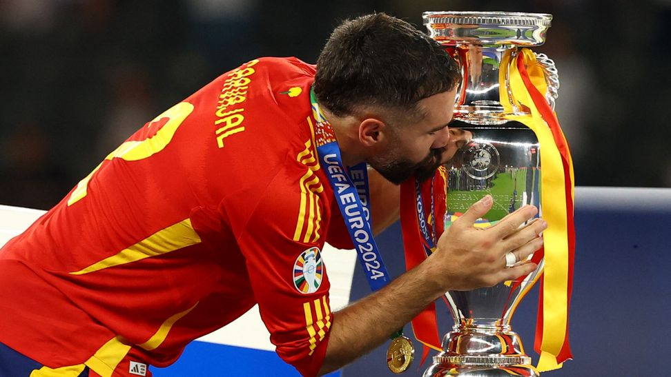
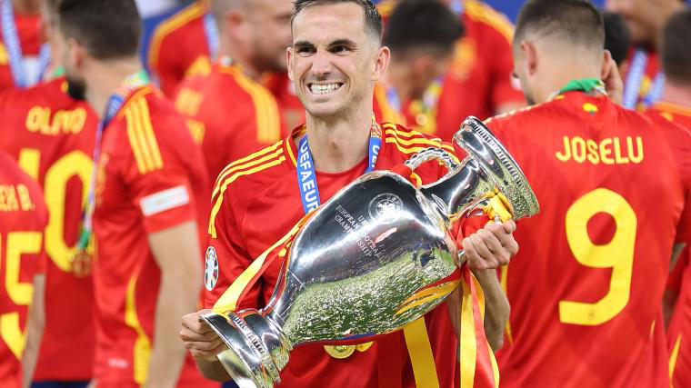

# El meu document Markdown

Una lista de los mejores jugadores de la pasada edición de la Eurocopa 2024:

1. Rodrigo Hernández
2. Lamine Yamal
3. Dani Olmo
4. Jamal Musiala
5. Nico Williams
6. Harry Kane
7. Wirtz
8. Dani Carvajal
9. Schranz
10. Fabían Ruiz


També podeu afegir [enllaços]











Podeu ressaltar el text en *cursiva* o **negreta** segons les vostres necessitats.

```javascript
// Aquest és un bloc de codi
exemple de funció () {
     // Exemple de codi
}
